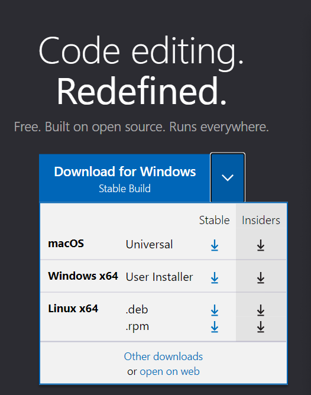
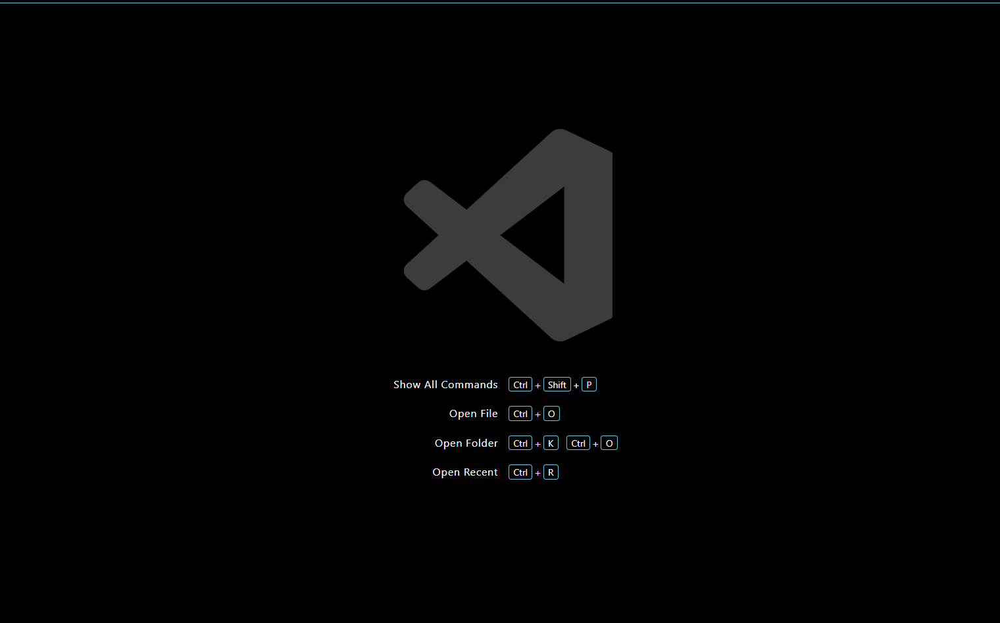
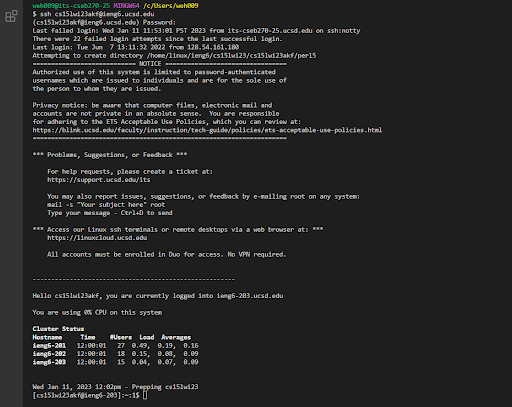
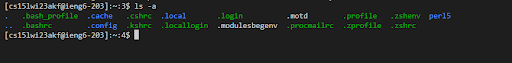

# cse-15l-lab-report-week1
## Lab Report 1
### Step 1: Installing Visual Studio Code
Go to the Visual Studio Code website **[Visual Stuido Code](https://code.visualstudio.com/)** to access the installation link. 

From this link, there should be a link to download Visual Studio Code. Depending on what operating system your computer functions on, you may want to change the link by clicking the dropdown menu to select the proper version of Visual Studio Code to install that best suits your computer's operating system. 



After installing Visual Studio Code, you should see the following when opening up the application. 



### Step 2 Remotely Connecting:
If you are using Windows, download Git for Windows from this link 

**[Git for Windows](https://gitforwindows.org/)**

Once installed follow the instructions from this link to understand how to use bash for Windows in VScode

**[Using Bash in VScode](https://stackoverflow.com/questions/42606837/how-do-i-use-bash-on-windows-from-the-visual-studio-code-integrated-terminal/50527994#50527994)**

Once installed, open the terminal then use the command

```
# code block
ssh ssh cs15lwi23zz@ieng6.ucsd.edu
```
Make sure the zz is replaced with your course specific account letter combination, if that is not known use the following link to look it up:

**[Account Lookup](https://sdacs.ucsd.edu/~icc/index.php)**

Since this is the first time you are remotely accessing your account, you will be prompted with the following message 

```
# code block
⤇ ssh cs15lwi23zz@ieng6.ucsd.edu
The authenticity of host 'ieng6.ucsd.edu (128.54.70.227)' can't be established.
RSA key fingerprint is SHA256:ksruYwhnYH+sySHnHAtLUHngrPEyZTDl/1x99wUQcec.
Are you sure you want to continue connecting (yes/no/[fingerprint])? 
```

Simply reply with yes, it will then prompt you for your password 

Enter your password and you should see the following.



This means you have successfully connected remotely.

### Step 3: Running Some Commands:

Since everything is setup now, you can now run some commands through terminal to test it. Here are some suggestions to try

* cd ~
* cd
* ls -lat
* ls -a

Here is a result of what running a command inside the terminal would yield, this is for the ls -a command 

What ls -a essentially does it look through all the files including files that are hidden. It also displays directories. This step is about learning how to utilize the terminal to source and find files inside your laptop and to search through your laptop to access certain directories to assist in project building.


